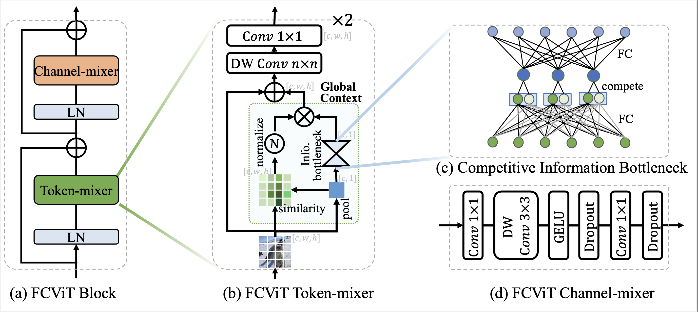
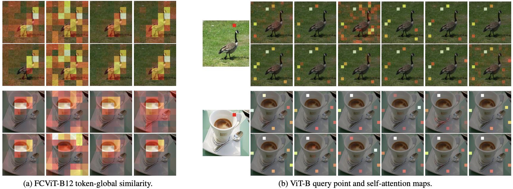

# A Close Look at Spatial Modeling: From Attention to Convolution

by [Xu Ma](https://ma-xu.github.io/), [Huan Wang](http://huanwang.tech/), [Can Qin](https://canqin.tech/), [Kunpeng Li](https://kunpengli1994.github.io/), [Xingchen Zhao](https://www.xingchenzhao.com/), [Jie Fu](https://bigaidream.github.io/), [Yun Fu](http://www1.ece.neu.edu/~yunfu/)

<div align="left">
    <a></a>
    <a></a>
    <a></a>
    <a></a>
</div>


## Motivation
<div align="center">
  
</div>

Figure 1: Attention map visualizations of Vision Transformers. For each pair, we show the **query point** and its corresponding **attention map** (of last block and last head). We randomly selected images and the query points for illustration. The right color bar identifies the value of normalized attention maps. 

:eyes: :bangbang: **Observations & Motivations:**
 * :small_orange_diamond: **`Query-irrelevant behavior.`** The attention maps consistently show a query-irrelevant (and even head-irrelevant) behavior. Visually, the attention maps appear to be nearly identical for each testing model and image, regardless of the query patch. This is a departure from the design philosophy of self-attention that each patch should exhibit a distinct attention map.
 * :small_orange_diamond: **`Sparse attention.`**  The attention weights (see ViT-B, ViT- L, and DeiT-B) are relatively sparse, indicating that only several patches dominate the attention.
 * :small_orange_diamond: **`Convolution helps.`** By introducing the knowledge from convolution, the attention weights (see DeiT-B-Distill) are largely smoothed, and the performance is significantly improved as well (83.4% of DeiT-B-Distill vs. 81.8% of DeiT-B top-1 accuracy on ImageNet-1K validation set).


## Solution: From Attention to Convolution
<div align="center">
  
</div>

Figure 2: Illustration of an FCViT block. Following MetaFormer, FCViT considers the block as a combination of token-mixer and channel-mixer, with residual connection and layer normalization (LN). In the token-mixers, we dynamically integrate the global context with input tokens by the token-global similarity. A depth-wise convolution is employed to fuse local information. To improve the generalization ability of the global context, we introduce a competition-driven information bottleneck structure.


<div align="center">
  
</div>

Figure 3: Visual comparisons of `FCViT-B12 similarity` and `ViT-B attention map`. We plot all the outputs of the last block for the two models (8 groups for FCViT and 12 heads for ViT). Compared to ViT, the results indicate that: **1), FCViT focuses more on the objects**; **2), FCViT presents more diversities than multi-head attention**, whose attention maps from different heads are nearly the same.

----

## Image Classification
### 1. Requirements

torch>=1.7.0; torchvision>=0.8.0; pyyaml; [apex-amp](https://github.com/NVIDIA/apex) (if you want to use fp16); [timm](https://github.com/rwightman/pytorch-image-models) (`pip install git+https://github.com/rwightman/pytorch-image-models.git@9d6aad44f8fd32e89e5cca503efe3ada5071cc2a`)

data prepare: ImageNet with the following folder structure, you can extract ImageNet by this [script](https://gist.github.com/BIGBALLON/8a71d225eff18d88e469e6ea9b39cef4).

```
│imagenet/
├──train/
│  ├── n01440764
│  │   ├── n01440764_10026.JPEG
│  │   ├── n01440764_10027.JPEG
│  │   ├── ......
│  ├── ......
├──val/
│  ├── n01440764
│  │   ├── ILSVRC2012_val_00000293.JPEG
│  │   ├── ILSVRC2012_val_00002138.JPEG
│  │   ├── ......
│  ├── ......
```


### 2. FCViT Models

| Model    |  #params | Image resolution | Top1 Acc| Download | 
| :---     |   :---:    |  :---: |  :---:  |  :---:  |
| FCViT-tiny  |    4.6M     |   224 |  74.9  | [download](https://drive.google.com/drive/folders/1YSa8tkXkUQT94mgo-L7q4pv5KiHRTAaR?usp=sharing) |
| FCViT-B12 |   14M     |   224 |  80.9  | [download](https://drive.google.com/drive/folders/1QuyalIGhJeD2pxcVxR0_gJNrk2mZ8WEb?usp=sharing) |
| FCViT-B24  |   25.7M     |   224 |  82.5  | [download](https://drive.google.com/drive/folders/1II2v1rhNe9sgLJtoSR-cgSh2mpPQMt4t?usp=sharing) |
| FCViT-B48 |   49.1M     |   224 |  83.6 | [download](https://drive.google.com/drive/folders/16joP1cQwbx4oICL-WbPC1SqGNoc4-NZm?usp=sharing) |


### 3. Validation

To evaluate our FCViT models, run:

```bash
MODEL=fcvit_tiny #{tiny, b12, b24, b48}
python3 validate.py /path/to/imagenet  --model $MODEL -b 128 --checkpoint {/path/to/checkpoint} 
```


### 4. Train
We show how to train FCViT on 8 GPUs. The relation between learning rate and batch size is lr=bs/1024*1e-3.
For convenience, assuming the batch size is 1024, then the learning rate is set as 1e-3 (for batch size of 1024, setting the learning rate as 2e-3 sometimes sees better performance). 


```bash
MODEL=fcvit_tiny # fcvit_{tiny, b12, b24, b48}
DROP_PATH=0.1 # drop path rates [0.1, 0.1, 0,1, 0.2] responding to model [tiny, b12, b24, b48]
CUDA_VISIBLE_DEVICES=0,1,2,3,4,5,6,7 ./distributed_train.sh 8 /path/to/imagenet \
  --model $MODEL -b 128 --lr 1e-3 --drop-path $DROP_PATH --apex-amp
```

### 5. Detection and Segmentation

For detection and segmentation tasks, please see here: [[detection & instance segmentation]](./detection) and [[semantic segmentation]](./segmentation).


## Acknowledgment
Our implementation is mainly based on the following codebases. We gratefully thank the authors for their wonderful works.

[poolformer](https://github.com/sail-sg/poolformer), [pytorch-image-models](https://github.com/rwightman/pytorch-image-models), [mmdetection](https://github.com/open-mmlab/mmdetection), [mmsegmentation](https://github.com/open-mmlab/mmsegmentation).

## Citation
```
@article{ma2022fcvit,
  author      = {Ma, Xu and Wang, Huan and Qin, Can and Li, Kunpeng and Zhao, Xingchen and Fu, Jie and Fu, Yun},
  title       = {A Close Look at Spatial Modeling: From Attention to Convolution},
  publisher   = {arXiv},
  year        = {2022},
}
```
